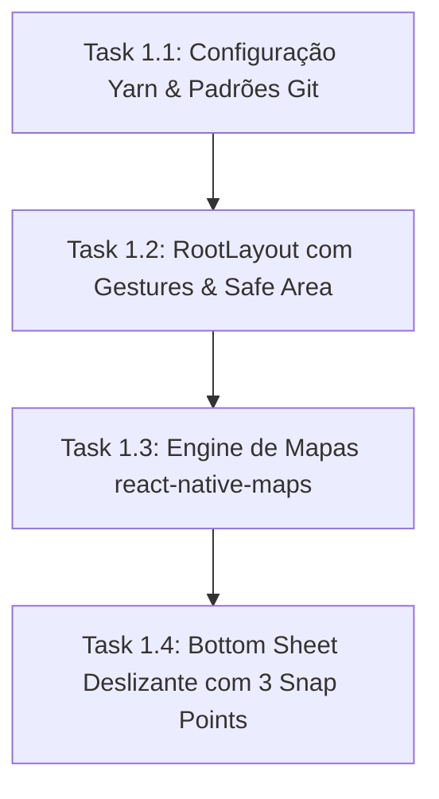
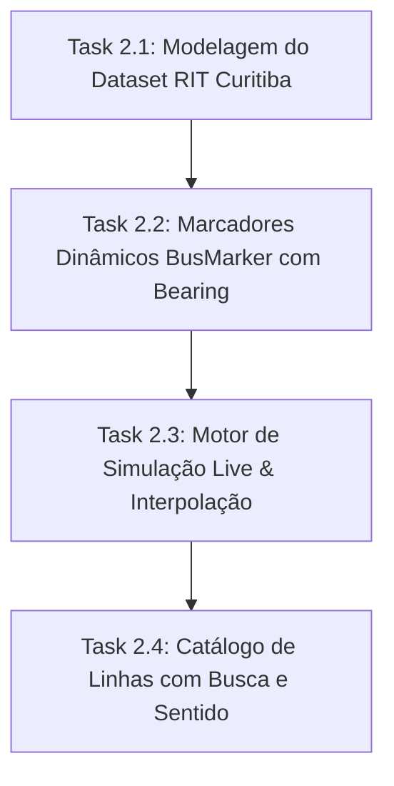
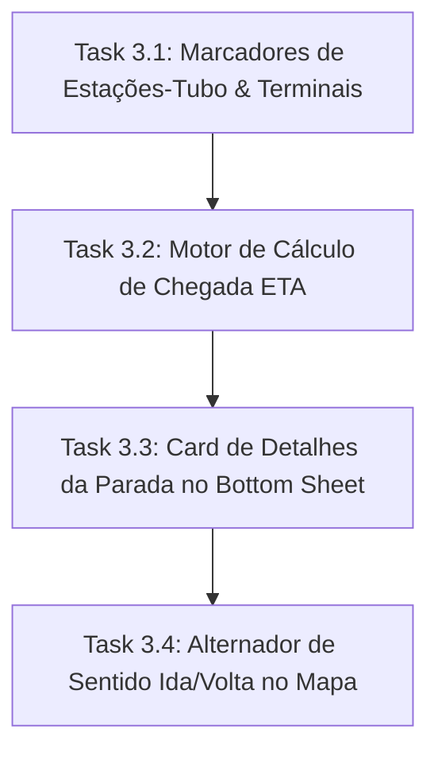
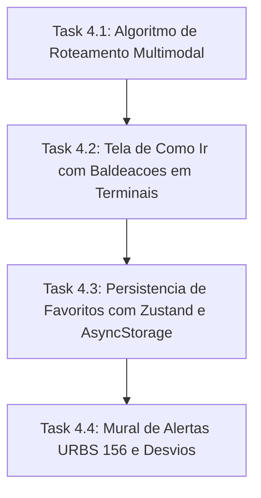

# Especificação Mestre & Planejamento ClickUp: Curitiba Ônibus RIT (React Native + Expo)

Este documento estabelece o **guia arquitetural definitivo, decisões técnicas pesquisadas, convenção de Git/Commits e o backlog exaustivo mapeado para o ClickUp** antes do início de qualquer nova etapa de código.

---

## 1. Padrão de Gerenciamento de Pacotes & Fluxo Git / ClickUp

### 1.1. Regra de Ouro: Uso Exclusivo do Yarn
- Todo o ciclo de vida de dependências no projeto deve ser executado via **`yarn`** (v1.22.22+).
- **Proibido** o uso de `npm install` ou `npx` que crie `package-lock.json`.
- Configurado no `package.json`: `"packageManager": "yarn@1.22.22"`.
- Scripts principais:
  - Iniciar ambiente: `yarn start`
  - Iniciar no iOS: `yarn ios`
  - Iniciar no Android: `yarn android`
  - Iniciar na Web: `yarn web`
  - Checagem de tipos estrita: `yarn tsc --noEmit`
  - Linting de código: `yarn lint`

### 1.2. Estratégia de Branches & Nomenclatura
As branches de desenvolvimento devem espelhar as tarefas criadas no ClickUp:

```text
main (produção / versão estável)
  └── develop (integração contínua da sprint)
        ├── feat/CU-[TaskID]-[slug-da-tarefa]
        ├── fix/CU-[TaskID]-[slug-da-correcao]
        └── chore/CU-[TaskID]-[slug-da-manutencao]
```

*Exemplo:* `feat/CU-86a101-render-bus-markers`

### 1.3. Convenção de Commits (Conventional Commits + ClickUp Task ID)
Todo commit deve seguir o padrão: `<tipo>(<escopo>): [CU-<TaskID>] <descrição imperativa>`

*Tipos permitidos:*
- `feat`: Nova funcionalidade
- `fix`: Correção de bug
- `perf`: Melhoria de performance (ex: otimização de re-render no mapa)
- `refactor`: Refatoração sem alteração de comportamento
- `style`: Ajustes puramente visuais/Tailwind/NativeWind
- `test`: Testes unitários ou de integração
- `chore`: Configurações de build, dependências ou tooling

*Exemplos de commits:*
- `feat(map): [CU-86a101] renderizar marcadores de onibus com rotacao por bearing`
- `fix(transit): [CU-86b202] corrigir interpolacao da linha 500 no terminal hauer`
- `perf(markers): [CU-86a103] desativar tracksViewChanges para manter mapa em 60fps`

---

## 2. Pesquisa de Benchmarking & Decisões Técnicas Definitivas

### 2.1. Síntese do Benchmark de Visualização de Mapas

| Aplicativo | Recurso de Destaque | Decisão Arquitetural Adotada no Projeto |
| :--- | :--- | :--- |
| **Google Maps** | Navegação por camadas e painel deslizante com múltiplos estágios de altura. | `@gorhom/bottom-sheet` integrado com `react-native-gesture-handler` com snap points em 12% (visão total do mapa), 45% (resumo da linha/parada) e 88% (detalhes e itinerário completo). |
| **Waze** | Ícone de veículo que aponta suavemente para a direção do deslocamento. | Cálculo trigonométrico de *Bearing* ($\theta = \text{atan2}(y, x)$) aplicado ao `transform: [{ rotate: '${bearing}deg' }]` no `BusMarker`. |
| **Transit App** | Contraste tipográfico pesado, cores vivas para cada categoria de ônibus e contador regressivo. | Sistema de cores oficial da RIT de Curitiba: 🔴 Expresso (`#E11D48`), ⚪ Ligeirinho (`#475569`), 🟢 Interbairros (`#16A34A`), 🟠 Alimentador (`#EA580C`), 🟡 Troncal (`#CA8A04`). Badge estilizado com alta legibilidade. |
| **Moovit** | Detalhes de paradas com lista de ônibus e roteirizador multimodal com conexões. | Tela dedicada de "Como Ir" calculando caminhada + tempo no ônibus + integração sem custo em terminais de Curitiba. |
| **Curitiba 156 / App** | Conhecimento local de estações-tubo e comunicados oficiais de desvios da URBS. | Marcadores diferenciados para Estações-Tubo e Terminais, mais aba dedicada de alertas e notícias oficiais da URBS. |

### 2.2. Solução de Alta Performance para Mapas Mobile (60 FPS)
1. **Engine Nativa (`react-native-maps`):**
   - No iOS: Apple Maps (renderização acelerada por GPU com Metal).
   - No Android: Google Maps Nativo (renderização acelerada por Vulkan/OpenGL).
2. **Eliminação de Jitter em Marcadores:**
   - Ativação de `tracksViewChanges={false}` nos marcadores após a montagem do componente. Isso impede que a ponte React Native fique recalculando bitmaps vetoriais a cada frame.
3. **Interpolação de Trajeto com Lerp:**
   - Em vez de saltar de coordenada bruscamente a cada atualização, uma função de interpolação matemática suave divide o deslocamento ao longo do tempo do intervalo, garantindo que o ônibus pareça realmente dirigir pela via.
4. **Fallback Web para Desenvolvimento Rápido:**
   - Implementação de tela simulada na Web para que testes de lógica, catálogo e rotas funcionem sem necessidade obrigatória de emulador nativo aberto o tempo todo.

---

## 3. Mapeamento Exaustivo de Épicos & Tasks para o ClickUp

Abaixo está a especificação completa para criação direta no **ClickUp**:

### 🏢 Estrutura no ClickUp
- **Workspace:** Mobilidade Urbana
- **Espaço (Space):** Engenharia de Software
- **Pasta (Folder):** Curitiba Bus App
- **Listas (Sprints):**
  - `Sprint 1 - Setup, Tooling & Engine de Mapas`
  - `Sprint 2 - Tempo Real, Interpolação & Linhas RIT`
  - `Sprint 3 - Paradas, Tubos & Previsão de Chegada (ETA)`
  - `Sprint 4 - Planejador de Rotas ("Como Ir") & Favoritos`

---

### 🚀 SPRINT 1: Setup, Tooling & Engine de Mapas



#### Task 1.1: Padronização de Tooling com Yarn & Hooks de Commit
- **ID ClickUp:** `CU-101`
- **Tipo:** Tarefa Técnica / Infraestrutura
- **Prioridade:** 🔴 Urgente | **Estimativa:** 2 pts
- **Stack:** Yarn v1.22, Expo SDK 57, TypeScript, ESLint
- **Descrição:**
  - Garantir uso exclusivo do Yarn e configurar scripts de build e verificação.
  - Configurar política de Conventional Commits referenciando o ID da tarefa ClickUp.
- **Critérios de Aceite:**
  - `yarn install` executa sem gerar `package-lock.json`.
  - `yarn tsc --noEmit` valida todos os tipos estritos com zero erros.
- **Padrão de Commit:** `chore(tooling): [CU-101] configurar yarn e regras de commit`

#### Task 1.2: Arquitetura de Layout Raiz com Provedores de Gestos & Abas
- **ID ClickUp:** `CU-102`
- **Tipo:** Funcionalidade
- **Prioridade:** 🔴 Urgente | **Estimativa:** 3 pts
- **Stack:** Expo Router v4, `react-native-gesture-handler`, `lucide-react-native`
- **Descrição:**
  - Implementar layout raiz em `src/app/_layout.tsx` encapsulado por `GestureHandlerRootView` e `SafeAreaProvider`.
  - Configurar a barra de abas inferior (`src/app/(tabs)/_layout.tsx`) com 4 seções: Mapa, Linhas, Como Ir e Favoritos.
- **Critérios de Aceite:**
  - Alternância suave entre as 4 abas sem piscar a tela.
  - Ícones Lucide vetorizados com cor ativa `#E11D48` (Vermelho RIT).
- **Padrão de Commit:** `feat(navigation): [CU-102] estruturar abas do expo-router com gesture-handler`

#### Task 1.3: Engine do Mapa Interativo com Tema Customizado
- **ID ClickUp:** `CU-103`
- **Tipo:** Funcionalidade
- **Prioridade:** 🔴 Urgente | **Estimativa:** 5 pts
- **Stack:** `react-native-maps`, `expo-location`
- **Descrição:**
  - Montar o componente `CuritibaMap` centralizado nas coordenadas de Curitiba (`-25.4284, -49.2733`).
  - Aplicar `LIGHT_MAP_STYLE` com redução de ruído visual (remoção de POIs desnecessários para foco total nas vias de transporte).
  - Integrar permissões do usuário com `expo-location` e botão flutuante para centralizar no GPS.
- **Critérios de Aceite:**
  - Mapa carrega em 60fps com gestos fluidos de pinça e rotação.
  - Toque no botão de localização voa a câmera suavemente para a posição do usuário.
- **Padrão de Commit:** `feat(map): [CU-103] implementar engine de mapa com estilos limpos e gps`

#### Task 1.4: Painel Deslizante Interativo (Bottom Sheet)
- **ID ClickUp:** `CU-104`
- **Tipo:** Funcionalidade
- **Prioridade:** 🟡 Alta | **Estimativa:** 5 pts
- **Stack:** `@gorhom/bottom-sheet`, `react-native-reanimated`
- **Descrição:**
  - Implementar componente deslizante na parte inferior da tela do mapa.
  - Permitir que o usuário visualize o mapa no nível mínimo (12%), consulte paradas próximas no nível intermediário (45%) e visualize a lista completa no nível expandido (88%).
- **Critérios de Aceite:**
  - O mapa de fundo continua recebendo gestos de arrasto e zoom enquanto a gaveta está nos níveis inferior e intermediário.
  - Gaveta se move a 60fps impulsionada por Reanimated.
- **Padrão de Commit:** `feat(ui): [CU-104] implementar bottom sheet interativo com snap points`

---

### 🚌 SPRINT 2: Tempo Real, Interpolação & Linhas RIT



#### Task 2.1: Modelagem Georreferenciada do Dataset da RIT Curitiba
- **ID ClickUp:** `CU-201`
- **Tipo:** Funcionalidade / Dados
- **Prioridade:** 🔴 Urgente | **Estimativa:** 5 pts
- **Stack:** TypeScript, Dados Geoespaciais
- **Descrição:**
  - Mapear coordenadas exatas de vias, canaletas, terminais e tubos de Curitiba.
  - Cadastrar linhas representativas: 203 (Santa Cândida/Capão Raso), 500 (Ligeirão Boqueirão), 303 (Centenário/Campo Comprido), 020 (Interbairros II) e 216 (Cabral/Portão).
- **Critérios de Aceite:**
  - Tipagem estrita de `BusLine`, `BusStop` e `BusVehicle`.
  - Trajetos possuem polylines contínuas que acompanham o traçado urbano real.
- **Padrão de Commit:** `feat(data): [CU-201] modelar linhas estruturantes e tubos da RIT Curitiba`

#### Task 2.2: Marcadores de Ônibus Dinâmicos com Ângulo de Deslocamento
- **ID ClickUp:** `CU-202`
- **Tipo:** Interface / Performance
- **Prioridade:** 🟡 Alta | **Estimativa:** 5 pts
- **Stack:** `react-native-maps`, Componentes Customizados
- **Descrição:**
  - Criar `BusMarker` com badge da cor da categoria (Vermelho, Prata, Verde, Laranja), código da linha e prefixo do veículo.
  - Inserir ponteiro direcional no topo que gira automaticamente conforme o *bearing* do veículo.
  - Ativar `tracksViewChanges={false}` para assegurar máxima taxa de quadros.
- **Critérios de Aceite:**
  - Ônibus apontam na direção real para a qual estão trafegando.
  - Distinção imediata de quais linhas estão na tela através do código e da cor.
- **Padrão de Commit:** `feat(map): [CU-202] criar marcadores de onibus com rotacao por bearing e otimizacao`

#### Task 2.3: Motor de Movimento Contínuo & Atualização em Tempo Real
- **ID ClickUp:** `CU-203`
- **Tipo:** Lógica de Negócio / Engine
- **Prioridade:** 🟡 Alta | **Estimativa:** 5 pts
- **Stack:** TanStack Query, Matemática Geoespacial (Lerp + Haversine)
- **Descrição:**
  - Implementar serviço `transitService` que distribui frotas ativas pelas linhas e move suas posições a cada 3 a 5 segundos.
  - Calcular latitude/longitude interpoladas entre os nós do trajeto.
  - Pausar o ciclo de simulação quando a aplicação estiver em segundo plano.
- **Critérios de Aceite:**
  - Veículos realizam percurso completo (Ida e Volta) de forma contínua sem saltos bruscos.
  - Hook `useLiveVehicles` fornece a lista reativa atualizada para o mapa.
- **Padrão de Commit:** `feat(realtime): [CU-203] desenvolver motor de rastreamento com interpolacao de movimento`

#### Task 2.4: Catálogo de Linhas com Busca Instantânea e Filtro RIT
- **ID ClickUp:** `CU-204`
- **Tipo:** Funcionalidade / Tela
- **Prioridade:** 🟢 Média | **Estimativa:** 4 pts
- **Stack:** Expo Router (`lines.tsx`), NativeWind / StyleSheet
- **Descrição:**
  - Criar tela de catálogo com campo de busca por nome ou número da linha.
  - Adicionar pílulas de filtro por categoria (Expressos, Ligeirinhos, Interbairros, Alimentadores).
  - Incluir botão "Ver no Mapa", que seleciona a linha e redireciona o usuário para o mapa com o trajeto focado.
- **Critérios de Aceite:**
  - Filtragem instantânea ao digitar.
  - Clique em "Ver no Mapa" isola a linha no mapa e renderiza sua polyline colorida.
- **Padrão de Commit:** `feat(lines): [CU-204] implementar catalogo de linhas com busca e atalho no mapa`

---

### 🛑 SPRINT 3: Paradas, Tubos & Previsão de Chegada (ETA)



#### Task 3.1: Marcadores Icônicos de Estações-Tubo e Terminais
- **ID ClickUp:** `CU-301`
- **Tipo:** Interface / Mapa
- **Prioridade:** 🟡 Alta | **Estimativa:** 3 pts
- **Stack:** `react-native-maps`, Ícones Vetoriais
- **Descrição:**
  - Criar `StopMarker` com design estilizado: formato cilíndrico azul para estações-tubo e badge dourado para terminais integrados.
  - Controlar nível de zoom para não sobrecarregar visualmente o mapa em altitudes distantes.
- **Critérios de Aceite:**
  - Toque em uma estação destaca o marcador e abre imediatamente a previsão de chegada no painel inferior.
- **Padrão de Commit:** `feat(stops): [CU-301] estilizar marcadores de estacoes-tubo e terminais`

#### Task 3.2: Motor de Cálculo de Tempo Estimado de Chegada (ETA)
- **ID ClickUp:** `CU-302`
- **Tipo:** Lógica de Negócio / Algoritmo
- **Prioridade:** 🟡 Alta | **Estimativa:** 5 pts
- **Stack:** TypeScript, Haversine Formula
- **Descrição:**
  - Implementar método `getArrivalsForStop(stopId)` no `transitService`.
  - Calcular a distância em metros do veículo mais próximo daquela linha até o ponto selecionado.
  - Converter distância em minutos com base na velocidade média de canaleta/trânsito urbano (~22 km/h).
- **Critérios de Aceite:**
  - Ônibus a menos de 400m exibem status "Chegando".
  - Ônibus mais distantes exibem contagem regressiva em minutos (ex: "4 min", "12 min").
- **Padrão de Commit:** `feat(eta): [CU-302] desenvolver calculador de previsao de chegada em tempo real`

#### Task 3.3: Visão de Parada Selecionada no Bottom Sheet
- **ID ClickUp:** `CU-303`
- **Tipo:** Interface
- **Prioridade:** 🟡 Alta | **Estimativa:** 4 pts
- **Stack:** Bottom Sheet, Componentes UI
- **Descrição:**
  - Renderizar no Bottom Sheet o nome da parada, bairro e tipo de instalação.
  - Listar os ônibus que estão a caminho com contadores regressivos coloridos, prefixo do veículo e selo de acessibilidade ♿.
  - Permitir favoritar a parada diretamente pelo botão de marcador.
- **Critérios de Aceite:**
  - Lista de próximas chegadas atualiza os minutos de forma sincronizada com o movimento dos veículos.
- **Padrão de Commit:** `feat(ui): [CU-303] criar card de detalhes de estacao com chegadas ao vivo`

#### Task 3.4: Traçado de Rota (Polyline) e Alternador de Sentido
- **ID ClickUp:** `CU-304`
- **Tipo:** Funcionalidade / Mapa
- **Prioridade:** 🟡 Alta | **Estimativa:** 4 pts
- **Stack:** `react-native-maps` (`Polyline`), Zustand
- **Descrição:**
  - Renderizar a polyline da linha ativa com a cor correspondente (ex: Vermelho para a 203).
  - Inserir botão flutuante e na gaveta para alternar entre "Sentido Ida" e "Sentido Volta".
  - Redesenhar automaticamente o trajeto e inverter a ordem das paradas ao alternar o sentido.
- **Critérios de Aceite:**
  - Traçado se adapta imediatamente ao sentido selecionado.
  - Apenas as paradas do sentido ativo aparecem em destaque.
- **Padrão de Commit:** `feat(routes): [CU-304] integrar alternancia de sentido ida/volta com redesenho de rota`

---

### 🗺️ SPRINT 4: Planejador de Rotas ("Como Ir") & Favoritos



#### Task 4.1: Motor de Roteamento Ponto-a-Ponto com Terminais Integrados
- **ID ClickUp:** `CU-401`
- **Tipo:** Algoritmo / Lógica de Negócio
- **Prioridade:** 🟡 Alta | **Estimativa:** 8 pts
- **Stack:** TypeScript, Roteador Geoespacial
- **Descrição:**
  - Implementar função `planTransitTrip(origin, destination)` que analisa a proximidade das paradas em relação aos dois pontos.
  - Identificar conexões diretas (mesma linha servindo os dois pontos) ou rotas com 1 baldeação nos terminais integrados da RIT (ex: Cabral, Portão, Rui Barbosa).
  - Calcular trechos a pé com velocidade média de pedestre (80 m/min).
- **Critérios de Aceite:**
  - Geração de opções ordenadas pelo menor tempo total de viagem.
  - Indicação clara de gratuidade na transferência física dentro dos terminais.
- **Padrão de Commit:** `feat(planner): [CU-401] criar motor de roteamento multimodal com integracao em terminais`

#### Task 4.2: Interface do Planejador de Viagens ("Como Ir" - Moovit Style)
- **ID ClickUp:** `CU-402`
- **Tipo:** Funcionalidade / Tela
- **Prioridade:** 🟢 Média | **Estimativa:** 5 pts
- **Stack:** Expo Router (`routes.tsx`), Lucide Icons
- **Descrição:**
  - Construir formulário com campos de Origem e Destino e botão de inversão rápida (swap).
  - Adicionar atalhos com chips para trajetos populares (ex: "Rui Barbosa ➔ Cabral", "Carlos Gomes ➔ Boqueirão").
  - Exibir linha do tempo detalhada com ícones de caminhada, cartões de embarque nas linhas e paradas de descida.
- **Critérios de Aceite:**
  - Linha do tempo visual legível e intuitiva para o passageiro.
  - Inversão de origem/destino recalcula a viagem instantaneamente.
- **Padrão de Commit:** `feat(planner-ui): [CU-402] desenvolver interface de planejamento de rotas estilo moovit`

#### Task 4.3: Persistência Local de Favoritos com Zustand & AsyncStorage
- **ID ClickUp:** `CU-403`
- **Tipo:** Funcionalidade / Estado
- **Prioridade:** 🟢 Média | **Estimativa:** 3 pts
- **Stack:** Zustand (persist middleware), `@react-native-async-storage/async-storage`
- **Descrição:**
  - Criar store `useFavoritesStore` que armazena códigos de linhas e IDs de tubos favoritados.
  - Sincronizar as escolhas do usuário no armazenamento local persistente do aparelho.
  - Na aba "Favoritos", exibir cartões rápidos com as linhas salvas e os tubos frequentes com status do próximo ônibus.
- **Critérios de Aceite:**
  - Os itens favoritados permanecem intactos ao fechar e reabrir o aplicativo.
  - Acesso direto ao mapa a partir do cartão de favorito em 1 toque.
- **Padrão de Commit:** `feat(favorites): [CU-403] implementar persistencia de favoritos com zustand e async-storage`

#### Task 4.4: Mural de Alertas de Trânsito & Comunicados URBS (156)
- **ID ClickUp:** `CU-404`
- **Tipo:** Funcionalidade / Tela
- **Prioridade:** ⚪ Baixa | **Estimativa:** 3 pts
- **Stack:** Componentes UI
- **Descrição:**
  - Adicionar aba secundária no módulo de Favoritos para exibição de comunicados operacionais da URBS.
  - Notificar sobre obras na via, desvios provisórios de linhas e reforços de frota nos horários de pico.
- **Critérios de Aceite:**
  - Alertas informam claramente as linhas afetadas através dos badges oficiais da RIT.
- **Padrão de Commit:** `feat(alerts): [CU-404] implementar mural de avisos operacionais da urbs e desvios`

---

## 4. Matriz Consolidada de Tarefas & Estimativas (Pronta para ClickUp)

| ID | Tarefa | Sprint | Tipo | Prioridade | Estimativa |
| :--- | :--- | :--- | :--- | :--- | :--- |
| **CU-101** | Padronização de Tooling com Yarn & Hooks de Commit | Sprint 1 | Infra | 🔴 Urgente | 2 pts |
| **CU-102** | Arquitetura de Layout Raiz com Provedores de Gestos & Abas | Sprint 1 | Feat | 🔴 Urgente | 3 pts |
| **CU-103** | Engine do Mapa Interativo com Tema Customizado | Sprint 1 | Feat | 🔴 Urgente | 5 pts |
| **CU-104** | Painel Deslizante Interativo (Bottom Sheet) | Sprint 1 | Feat | 🟡 Alta | 5 pts |
| **CU-201** | Modelagem Georreferenciada do Dataset da RIT Curitiba | Sprint 2 | Dados | 🔴 Urgente | 5 pts |
| **CU-202** | Marcadores de Ônibus Dinâmicos com Ângulo de Deslocamento | Sprint 2 | Perf | 🟡 Alta | 5 pts |
| **CU-203** | Motor de Movimento Contínuo & Atualização em Tempo Real | Sprint 2 | Feat | 🟡 Alta | 5 pts |
| **CU-204** | Catálogo de Linhas com Busca Instantânea e Filtro RIT | Sprint 2 | Feat | 🟢 Média | 4 pts |
| **CU-301** | Marcadores Icônicos de Estações-Tubo e Terminais | Sprint 3 | UI | 🟡 Alta | 3 pts |
| **CU-302** | Motor de Cálculo de Tempo Estimado de Chegada (ETA) | Sprint 3 | Feat | 🟡 Alta | 5 pts |
| **CU-303** | Visão de Parada Selecionada no Bottom Sheet | Sprint 3 | Feat | 🟡 Alta | 4 pts |
| **CU-304** | Traçado de Rota (Polyline) e Alternador de Sentido | Sprint 3 | Feat | 🟡 Alta | 4 pts |
| **CU-401** | Motor de Roteamento Ponto-a-Ponto com Terminais Integrados | Sprint 4 | Feat | 🟡 Alta | 8 pts |
| **CU-402** | Interface do Planejador de Viagens ("Como Ir") | Sprint 4 | Feat | 🟢 Média | 5 pts |
| **CU-403** | Persistência Local de Favoritos com Zustand & AsyncStorage | Sprint 4 | Feat | 🟢 Média | 3 pts |
| **CU-404** | Mural de Alertas de Trânsito & Comunicados URBS (156) | Sprint 4 | Feat | ⚪ Baixa | 3 pts |
| **TOTAL**| **16 Tarefas Mapeadas** | **4 Sprints** | | | **69 Story Points** |

---

## 5. Definição de Concluído (Definition of Done - DoD)

Para qualquer tarefa ser dada como concluída no ClickUp e mergeada na branch de release:
1. Código compilando sem nenhum erro ou aviso via `yarn tsc --noEmit`.
2. Dependências instaladas e travadas exclusivamente no `yarn.lock`.
3. Commits estruturados com referência expressa ao ID da tarefa ClickUp.
4. Testado em dispositivo ou simulador com taxa estável de 60fps na navegação do mapa.
5. Verificação de responsividade visual nos modos claro e escuro.
